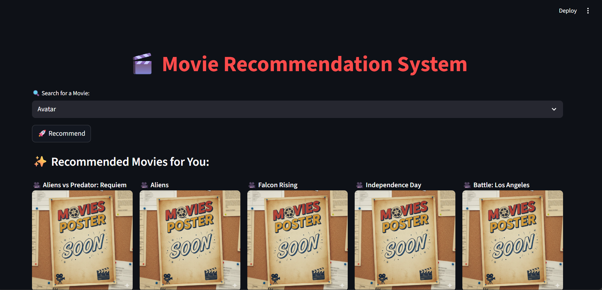

 🎬 Movie Recommendation System

A modern, interactive movie recommendation web app built with **Python** and **Streamlit**.  
It recommends movies based on similarity and displays them in a stylish, Netflix-like interface.

---

## Features

- Search for your favorite movies and get top 5 recommendations.  
- Beautiful, modern UI with poster cards and hover animations.  
- Uses a similarity matrix to suggest movies based on user input.  
- Easily extendable to include real movie posters using the TMDB API.

---

## Demo

---

## How to Run Locally

1. **Clone the repository:**

git clone https://github.com/Shubhojeet-kumar/Movie-recommendation.git

2. **Navigate into the folder:**

3. **Create a virtual environment (optional but recommended):**

python -m venv venv

4. **Activate the virtual environment:**
- Windows: `venv\Scripts\activate`
- Mac/Linux: `source venv/bin/activate`

5. **Install dependencies:**

pip install -r requirements.txt

6. **Run the Streamlit app:**

streamlit run app.py

---

## Folder Structure

movie-recommendation/
├─ app.py
├─ similarity.pkl
├─ movie_dict.pkl
├─ unnamed.png
├─ requirements.txt
├─ .gitignore
└─ README.md

---

## Dependencies

- Python 3.x  
- Streamlit  
- pandas  
- numpy  
- requests  

> You can install all dependencies using:

pip install -r requirements.txt